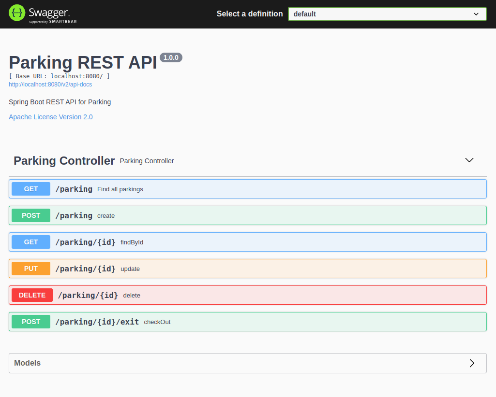

# Realizando Deploy na Nuvem de um conjunto de API’s desenvolvida em Spring Boot 
Desafio de projeto na plataforma de cursos online <a href="https://dio.me/"><strong> Digital Innovation One</strong></a>. 
Especialista: Sandro Giacomozzi

## 🎯 Objetivo do Projeto

Construir uma <strong>API</strong> para controle de um estacionamento de veículos. Esta <strong>API</strong> deverá controlar entrada e saída de veículos. 
Os dados deverão ser cadastrados em um banco de dados relacional.
Está <strong>API</strong> será exposta na nuvem, porém com controle de acesso. 
Desenvolvida com Spring-boot e Swagger

## 🛠 Tecnologias Utilizadas

- VS Code
- Java 11
- Maven
- Spring Web
- Spring Data JPA
- PostgreSQL Driver
- Spring Security 
- Swagger
- Lombok
- Heroku

### Modificações 
Devido erro de versão no Swagger, efetuei algumas mudanças nas dependências do arquivo pom.xml.
`@EnableSwagger2` foi removido.
A versão `Spring fox 3.0.0` não suporta o novo padrão `spring-boot 2.6.0` e acima, no meu caso era a versão 2.7.4.
Modifiquei as versões e funcionou com essas: 

	<parent>
		<groupId>org.springframework.boot</groupId>
		<artifactId>spring-boot-starter-parent</artifactId> 
		<version>2.5.2</version>
	</parent>

  <!-- https://mvnrepository.com/artifact/io.springfox/springfox-boot-starter  para fazer o swagger funcionar -->
		 <dependency>
				<groupId>io.springfox</groupId>
				<artifactId>springfox-boot-starter</artifactId>
				<version>3.0.0</version>
		</dependency> 
Modificando também o link de acesso de http://localhost:8080/swagger-ui.html
para http://localhost:8080/swagger-ui/index.html.
## 🔗 Links Úteis
[Acesso ao Swagger](http://localhost:8080/swagger-ui/index.html)

